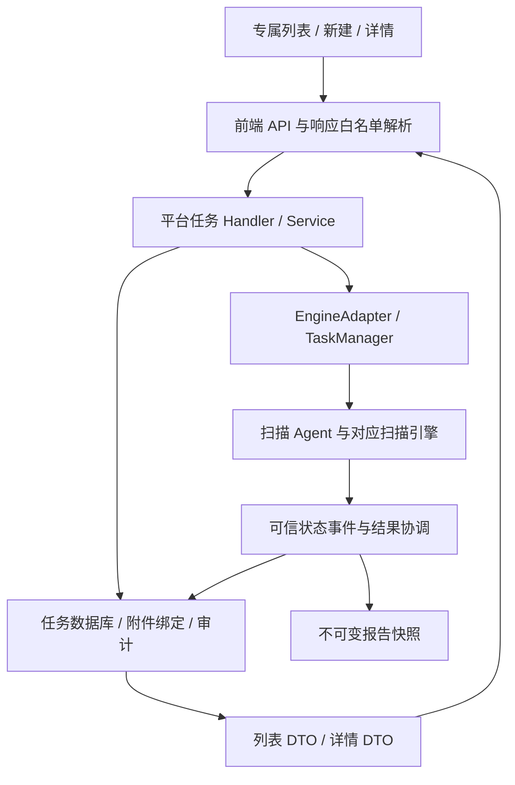

# AI 基础设施扫描开发说明与四类扫描接入规范

本文面向后续 MCP 扫描、模型红队评测和 Agent 扫描的产品、前端、后端与测试开发。以 AI 基础设施扫描的已实现代码为参照，约定专属工作台的页面组织、数据合同、治理边界和交付要求。

代码基线：`883ecbb9509e4018385a6897d1757239aad71a43`（2026-09-05，本地 `develop` 合并提交）；功能分支为 `codex/ai-infra-scan`。编写时该合并尚未成功推送 GitHub，不能假定远端 `develop` 已包含这些代码。本文记录这一实现快照，项目整体进度仍以[项目状态](../project/status.md)为准。

文中的“已实现”描述上述基线；“后续要求”是其他三类接入时需要落实的规范；建议路由和组件名不代表当前已存在。

## 1. 四类扫描与开发范围

| 产品类别 | 平台 `task_type` | 引擎历史类型 | 本文基线中的入口情况 |
| --- | --- | --- | --- |
| MCP 扫描 | `mcp_scan` | `Mcp-Scan` | 有通用创建与执行链路，专属工作台按本文接入。 |
| AI 基础设施扫描 | `ai_infra_scan` | `AI-Infra-Scan` | 已有专属列表、新建和详情路由。 |
| 模型红队评测 | `model_redteam_report` | `Model-Redteam-Report` | 有通用创建与执行链路，专属工作台按本文接入。 |
| Agent 扫描 | `agent_scan` | `Agent-Scan` | 有通用创建与适配合同；专属页及实际引擎能力需逐项验收。 |

平台新请求使用小写标准枚举；历史引擎类型由服务端规范化。新页面不能直接把侧栏显示文字当成任务类型。

当前导航还有一处待对齐事项：`navigation.ts` 的侧栏是“MCP 扫描 / Skills 扫描 / AI 基础设施扫描 / Agent 工作流扫描”，其中三个旧入口仍指向 `/tasks/new?scan=...`。当前通用创建页没有根据这些 `scan` 查询值选择类型，因此**链接上带了参数不等于专属功能已经接通**。现有标准任务枚举中没有 `skills_scan`，不能擅自将 Skills 与模型红队映射为同一种任务。后续接入必须先明确名称、路由、标准枚举与引擎能力的对应关系，并补路由测试。

本轮 UI 设计的范围是 AI 基础设施专属列表和新建页。详情页增加了安全摘要、模型名称恢复及备注展示，但没有完成与列表同规格的整页视觉重设计。侧栏和全局主题不属于该轮视觉改造范围。

## 2. 总体架构与复用原则

四类任务共用平台任务服务、鉴权、附件管理、幂等创建、调度、取消和报告快照链路。专属页面负责表达各自的业务输入与安全摘要。



三个必须沿用的边界：

- 浏览器使用 `/api/v1/platform/tasks`，不绕过平台服务调用旧扫描接口、内部 WebSocket 或读取原始引擎结果。
- 数据库实体、内部服务 `View`、引擎任务和浏览器 DTO 是不同合同；禁止直接序列化实体代替安全响应。
- 业务差异集中在目标输入、配置校验、引擎适配和摘要投影，不能为每类任务重建一套权限、幂等与调度机制。

## 3. 专属页面的标准结构

### 3.1 路由与权限

| 页面 | 已实现 AI 路由 | 组件接入 | 可访问角色 |
| --- | --- | --- | --- |
| 专属工作台 | `/tasks/ai-infra` | `TaskListPage fixedTaskType="ai_infra_scan"` | `user`、`auditor`、`admin` |
| 新建任务 | `/tasks/ai-infra/new` | `TaskCreatePage fixedTaskType="ai_infra_scan" returnTo="/tasks/ai-infra"` | `user`、`admin` |
| 任务详情 | `/tasks/ai-infra/:taskId` | `TaskDetailPage expectedTaskType="ai_infra_scan" returnTo="/tasks/ai-infra"` | `user`、`auditor`、`admin` |

通用 `/tasks`、`/tasks/new` 和 `/tasks/:taskId` 继续存在。专属列表强制指定类型，URL 中伪造的其他 `task_type` 不得改变它；专属详情遇到类型不符时显示不匹配状态，停止轮询并隐藏内容与取消操作。任务 ID 作为不透明标识处理，拼接路径时使用 `encodeURIComponent`。

服务端权限：普通用户只能读写自己的任务；审计员可读全局任务但不能创建、取消或下载原始附件；管理员可读写全局任务。前端角色控制是交互提示，最终授权由服务端执行。

其他类别采用“专属列表 / 新建 / 详情”三条路由。可考虑 `/tasks/mcp`、`/tasks/model-redteam`、`/tasks/agent`，但必须先核对当时路由与并行开发成果，不能把这些建议直接当成已实现路径。

### 3.2 工作台

页面顺序固定为：标题与新建入口 → 状态筛选 → 任务运行态势 → 任务列表与分页。

列表的业务行为：

- 服务端先做权限与类型、状态筛选，再分页。当前专属页面请求每页 20 条。
- URL 保存 `page`、`status`；专属类型由页面固定，不暴露可切换的类型下拉框。修改筛选回到第一页。
- 查询缓存键包含页码、页大小、状态和任务类型；请求使用查询提供的 `AbortSignal`。
- 状态筛选对应真实单一枚举。当前实现是下拉选择，不是设计图中的合并状态按钮。
- 区分加载、403、其他错误、无匹配结果和正常数据。错误时不能继续展示旧数据派生的统计。

四张指标卡必须按真实数据范围显示：

| 卡片 | 统计来源 | 分组规则 | 视觉语义 |
| --- | --- | --- | --- |
| 匹配任务 | 服务端 `total`，当前查询 | 当前权限及筛选下的总数 | 品牌蓝 |
| 正在执行 | 当前页 `items` | `running` | 绿色 |
| 等待调度 | 当前页 `items` | `pending` + `dispatching` | 橙色 |
| 需关注 | 当前页 `items` | `failed` + `dispatch_failed` + `dispatch_unknown` | 红色 |

四张卡始终保留，包括零值。后三张必须标注“当前页”，不能展示成全部任务统计，也不能假定四张卡的数值应相加相等。如果后续需要全局运行数量或跨状态合并筛选，应先增加受权限约束的服务端聚合合同，再修改 UI。

任务表使用六列：任务 ID、负责人、状态、创建时间、更新时间、操作。列表 DTO 没有目标、模型、备注、漏洞数或报告结论；不能通过逐行请求详情补出未经设计的新列。分页使用真实 `total/page/page_size`，当前不是可选每页条数控件。时间现有实现按 UTC 格式化，后续如改为用户时区，应统一列表和详情口径。

### 3.3 新建页：三段信息引导

这是一个完整表单内的三个可同时阅读的区域，不是逐步隐藏的向导。

| 区域 | AI 已实现内容 | 后续三类遵循的组织原则 |
| --- | --- | --- |
| 1 扫描对象 | 手工目标、导入目标清单、独立可选备注 | 放该类任务真实扫描对象及其录入方式；同一对象的不同来源并列呈现。 |
| 2 扫描配置 | 受治理模型、超时、端口模式；语言固定中文 | 仅放影响执行的配置，按模型/Agent/规则等实际治理来源选择。 |
| 3 确认并提交 | 授权范围说明、提交状态、取消与主操作 | 有明确主按钮、返回路径、校验与失败反馈。 |

AI 的手工目标与清单上传可任选其一，也可同时使用，至少有一个有效来源。已选择但尚未上传的文件不能当成已提供目标；存在待上传文件时创建按钮禁用。目标上传成功后才以附件 ID 加入创建请求。

备注标签为“任务说明 / 备注（可选）”，并显示当前 Unicode 码点数与 2,000 上限。主按钮为“创建 AI 基础设施扫描任务”，取消和返回均进入专属列表。固定中文体现在请求 `country_iso_code: "zh_CN"`，不是仅把控件隐藏；详情摘要返回 `language: "zh"`。

后续专属页沿用中文产品界面和清晰的业务文案。幂等键、DTO、opaque ID 等实现说明属于开发文档；产品页面的提示应解释用户可采取的行动，例如等待、刷新或显式重试。

### 3.4 详情与状态跟踪

已实现详情展示负责人、类型、状态、时间及类型专属安全摘要。AI 还显示超时、端口模式、目标数量、可恢复的模型名称和非空备注。

详情使用有界短轮询：非终态按约 2/4/8 秒退避，计数达到 8 后停止；`succeeded`、`failed`、`cancelled` 停止轮询。不要把调度失败或调度待确认直接当成相同终态。

取消只对允许写入的主体和非终态任务开放。成功响应为 204；网络或服务端确认不确定时，前端重新读取状态，展示待确认提示，不自动再次取消。后续页面必须覆盖切换任务 ID、卸载、请求晚返回和失败后的状态隔离。

当前详情不读取原始结果，也没有实现完整执行日志、实时拓扑或专属报告联动。后续若需要这些能力，应先定义经过权限校验和字段约束的新合同，不能直接恢复旧原始结果接口。

## 4. UI 设计与组件复用

AI 专属页使用现有 Fluent UI v9、Fluent Icons 和 Griffel；主操作采用主题品牌色，浅色模式下为蓝色，深色模式跟随已有主题令牌。页面有浅层背景、独立内容卡、明确标题、彩色指标图标和文本状态标签。

后续三类必须保持同一视觉层级：

- 页面主标题和创建操作位置一致；状态筛选、指标、表格各有明确容器。
- 使用 `tokens.colorBrand*`、`colorNeutral*`、状态色、间距和圆角令牌；不为专属页新增整套全局主题。
- 状态由文字、颜色与必要图标共同表达；保留焦点样式、字段标签、表格 `caption`、列标题和可键盘访问的滚动区。
- AI 源输入区在宽屏两列、840px 以下一列；配置区在 640px 以下一列；窄屏主操作适配可用宽度。
- 表格可以在自身容器内横向滚动；页面内容和输入控件不能因长 ID、文件名或状态标签撑破布局。
- 验收实际浏览器的浅色、深色及约 1440/768/320px 宽度，不能仅凭设计图片或组件测试认定视觉完成。

| 当前实现 | 可以复用的内容 | 接入其他类型前的调整 |
| --- | --- | --- |
| `AIInfraWorkbenchHeader` | 标题、副标题、返回链接、主操作布局 | 默认标题仍为 AI，抽公共组件时明确传入业务文案。 |
| `AIInfraWorkbench.styles.ts` | 页面、卡片、指标、表格、表单响应式规则 | 可提取为中性命名的共享样式，保留原 AI 视觉回归。 |
| `AIInfraTaskOperationsSummary` | 当前查询/当前页指标计算和展示 | 区域名称仍为 AI；复用前参数化标题和可访问名称。 |
| `AIInfraTaskTable` | 六列安全表、状态标签和分页 | 默认路径、标题及可访问名称仍为 AI；传入或提取这些配置。 |
| `GovernedModelSelector` | 单个受治理模型的分页选择与可用性验证 | 当前是可选单选；红队多目标和必选裁判模型不能直接照搬“不使用模型”。 |
| `tasks/api.ts` | 白名单解析、创建幂等、取消和轮询 | 保持统一实现，新增字段时同步合同。 |

`TaskListPage.fixedTaskType` 已接受标准类型，但目前只有 AI 值进入专属样式分支；`TaskCreatePage.fixedTaskType` 和 `TaskDetailPage.expectedTaskType` 当前类型签名只支持 AI。因此不能只替换路由参数就宣称其余三类已完成。

后续要求：在第二类专属工作台落地时提取确实共用的页面框架、文案和路由配置；类型专属表单独立维护。避免持续扩大同一个页面中的条件分支，也避免整份复制后让状态口径、权限或重试行为各自漂移。具体文件拆分由当时代码规模决定。

## 5. 输入字段和模型治理合同

### 5.1 字段职责

| 字段 | AI 含义 | 持久化/输出边界 |
| --- | --- | --- |
| `content` | 用户手工输入的目标表达式 | 平台保存并传给引擎；不在浏览器列表、详情原样返回。 |
| `attachment_ids` | 已上传目标清单的不透明 ID | 平台验证所有者、状态并绑定；引擎内部解析附件，浏览器任务 DTO 不返回原始绑定信息。 |
| `params` | 模型引用、超时、端口模式 | 服务端按类型精确校验；只把白名单摘要返回浏览器。 |
| `remark` | 此次任务的业务备注 | 去首尾空白后独立保存；只投影到已授权详情，不进入列表、引擎参数、审计元数据或报告快照。 |
| `target_count` | 服务端合并、展开、去重后的目标数量 | 由平台计算并保存；不是客户端可指定的创建字段。 |

备注按 Unicode 码点计数，最大 2,000；前端拒绝不完整代理字符，后端校验 UTF-8 和 rune 数。空白备注省略。修改备注属于修改创建请求，必须使旧提交对象失效；同幂等键而备注不同会被服务端拒绝。

其他类型的 `content` 可以是评测指令或工作流任务说明，不能机械套用 AI 的 IP 解析器。但“发给引擎的说明”和“不参与执行的任务备注”始终需要分开。通用后端和详情合同已具备 `remark`，其余专属 UI 的录入与展示还需各自接入。

### 5.2 AI 目标与端口约束

- 手工目标每行一条，支持 URL、域名、IPv4、IPv4 CIDR、闭区间和末尾通配符；详细语法以现有目标解析器为准。
- UTF-8 目标清单每个不超过 1 MiB；前端先提示，服务端创建时再次实际读取和校验。通用附件默认 50 MiB 的上限不能替代 AI 的 1 MiB 业务限制。
- 最多 10 个附件；`content` 最大 32 KiB，`params` 最大 64 KiB；创建 HTTP 正文限制为 256 KiB。字节限制与备注码点限制不是同一个单位。
- 服务端合并两种来源、展开并去重，最多 65,536 个唯一目标。浏览器预览仅计算手工输入，不能宣称包含附件内容。
- 新任务的详情 `target_count` 使用持久化的最终数量。历史记录为 0 时，当前实现回退到手工内容的非空行数，这是兼容摘要，不等于重新展开了历史目标或附件。
- `timeout` 为 1–86,400 秒，当前新建表单默认 300 秒。

| 端口模式 | API 值 | 扫描范围 |
| --- | --- | --- |
| 固定 AI 端口 | `fixed_ai` | `11434,1337,7000-9000,18789`，共 2,004 个端口 |
| 全量 TCP | `full_tcp` | `1-65535`，共 65,535 个端口 |

缺省端口模式由服务端规范化为 `fixed_ai`；新页面显式发送所选值。端口发现适用于裸 IPv4；URL、域名及其他目标形式不要承诺额外端口发现。选择全量 TCP 要明确提示耗时和网络压力。更多边界见[端口扫描模式说明](../product/ai-infrastructure-port-scan-mode-upgrade.md)。

### 5.3 受治理模型选择

模型来自“凭证配置 → 模型配置”的安全目录，浏览器只提交模型 ID，不复制 Token、API Key、连接地址或整份模型对象。

已实现选择器按每页 100 条加载，过滤停用模型、按 ID 规范化重复项，并检测重复分页和页码异常。标签仅组合模型名称、供应商模型和私有/全局范围。

可用性分为 `available / pending / unavailable`：已选模型尚在验证、目录刷新或加载失败时，不能把旧缓存当成已确认可用；保留待确认选择并提供重试。确认停用或完成目录遍历仍找不到时清除选择。AI 允许不使用模型，不能据此推断红队和 Agent 也允许缺失必选模型。

详情中的模型名称从当前受治理目录恢复；目录不可用时显示安全 ID 和重试入口，停用或不存在时回退安全 ID。该名称不是创建时的历史名称快照，不能把它当成模型配置审计记录。服务端在创建前仍须通过 `ValidateTaskReferences` 验证引用和权限，不能信任前端已经选择过。

## 6. API 合同与状态生命周期

### 6.1 共用接口

以下均为登录后的平台接口，浏览器使用现有同源 API 客户端处理会话。

| 操作 | 方法与路径 | 正常响应 |
| --- | --- | --- |
| 查询任务 | `GET /api/v1/platform/tasks?page=1&page_size=20&task_type=ai_infra_scan` | 200，`items/total/page/page_size` |
| 创建任务 | `POST /api/v1/platform/tasks`，携带 `Idempotency-Key` | 202，安全 `TaskDetail` |
| 读取详情 | `GET /api/v1/platform/tasks/:taskId` | 200，安全 `TaskDetail` |
| 取消任务 | `POST /api/v1/platform/tasks/:taskId/cancel` | 204 |
| 上传附件 | `POST /api/v1/platform/tasks/attachments`，multipart `file` | 201，附件摘要 |
| 分片附件 | `POST .../attachments/chunked`、`.../:attachmentID/chunks`、`.../:attachmentID/merge` | 复用现有附件客户端和接口合同 |

任务查询页码上限 1,000、单页上限 100；状态与类型只接受受支持的精确枚举。旧 `GET .../:taskId/result` 已退役，不能作为新页面的数据来源。完整错误、附件与报告接口见[中文 API 参考](../api/reference.md)。

AI 创建请求示例（示例 ID 必须替换为当前用户可用的真实治理引用）：

```http
POST /api/v1/platform/tasks
Content-Type: application/json
Idempotency-Key: <本次逻辑提交的唯一键>
```

```json
{
  "task_type": "ai_infra_scan",
  "content": "192.0.2.10\n192.0.2.16/30",
  "attachment_ids": [],
  "remark": "本次测试环境资产核查",
  "country_iso_code": "zh_CN",
  "params": {
    "model_id": "model-example",
    "timeout": 300,
    "port_scan_mode": "fixed_ai"
  }
}
```

不使用模型时省略 `params.model_id`；仅清单输入时 `content` 可为空，但必须有成功上传且可绑定的清单。前端不能发送伪造的 `owner`、任务状态或最终目标数量。

安全详情响应结构示例：

```json
{
  "id": "task-example",
  "owner": "example-user",
  "task_type": "ai_infra_scan",
  "status": "running",
  "remark": "本次测试环境资产核查",
  "created_at": "2026-09-05T05:00:00Z",
  "updated_at": "2026-09-05T05:01:00Z",
  "input_summary": {
    "language": "zh",
    "model_id": "model-example",
    "timeout": 300,
    "target_count": 5,
    "port_scan_mode": "fixed_ai"
  }
}
```

列表仅保留 `id/owner/task_type/status/created_at/updated_at`。`TaskDetail` 才增加 `input_summary` 和可选 `remark`。前端继续做字段白名单和类型、长度校验，不能把响应整体展开进组件状态或界面。

创建失败不一定代表任务未保存：调度失败可返回 503 和安全的 `task` 详情。必须沿用同一逻辑提交键处理确认与重试，不能收到 5xx 就生成新键再次创建。非法请求通常为 400，授权错误为 403；详情还需区分不存在和加载失败。

### 6.2 创建与幂等

1. 前端完成校验，构造稳定输入，通过 `createTaskSubmission` 建立一次逻辑提交；网络失败不自动重放 POST。
2. 服务端校验身份、任务类型、字段边界和精确参数结构。未知配置键不能悄悄穿透到引擎。
3. 使用所有者与幂等键派生稳定任务 ID，在创建锁内检查已有请求。相同键和相同输入复用任务，不同输入返回无效请求。
4. 新任务校验受治理引用、附件所有者与 ready 状态；AI 同时完成目标合并和最终数量计算。
5. 在既有审计事务中保存任务并绑定附件，再领取调度租约、构造引擎任务。
6. 引擎以 `PlatformTaskID` 作为稳定会话标识，重复提交不能产生第二次扫描。

平台调度存在最多 3 次的受控尝试与 30 秒租约。这与浏览器“不自动重发创建请求”是两层不同机制。引擎确认不确定时依靠可信状态查询或事件协调，不得把超时视为“肯定没执行”。

### 6.3 状态字典

| 状态值 | 页面文案 | 使用要求 |
| --- | --- | --- |
| `pending` | 等待调度 | 保留为独立状态。 |
| `dispatching` | 正在调度 | 指标可归入等待，表格仍显示精确文案。 |
| `running` | 执行中 | 由平台调度及可信状态推进。 |
| `succeeded` | 已完成 | 终态；可信完成结果进入报告快照链路。 |
| `failed` | 执行失败 | 执行终态，不等同于调度失败。 |
| `dispatch_failed` | 调度失败 | 在需关注组中，不能伪装为扫描结果失败。 |
| `dispatch_unknown` | 调度状态待确认 | 状态未知不能显示为成功或确定失败。 |
| `cancelled` | 已取消 | 终态，取消不可覆盖已确认的成功或失败结果。 |

这不是允许任意跳转的状态列表；实际转换、租约与并发比较更新以任务服务和引擎适配器为准。前端不计算或写入服务端状态。

## 7. 后端、数据库与文档变更规则

本次 v10 迁移通过追加迁移新增：

| 列 | SQL 定义 | 兼容意义 |
| --- | --- | --- |
| `platform_tasks.remark` | `text NOT NULL DEFAULT ''` | 旧任务读取为空，不显示备注。 |
| `platform_tasks.target_count` | `integer NOT NULL DEFAULT 0` | 新任务记录真实数量；旧任务保留兼容回退。 |

迁移在显式 `aig migrate` 阶段执行。运行时只校验所需版本、表、列、索引，不通过启动时 `AutoMigrate` 修补结构。发布过的旧迁移必须保持原样，不能给旧实体模型加字段后让历史迁移隐式改变。其他三类如仅复用通用备注，不需要再加一套同义列；确需改结构时，以当时最新版本追加迁移，不能机械重复使用 v10 或预定下一个版本号。

修改创建字段或详情摘要时，必须一起检查：

- `CreateInput`、实体、内存/GORM 仓储、幂等比较、引擎构造和报告快照边界。
- Go 浏览器 DTO、前端 TypeScript 合同及响应解析器。
- 中英文 API 参考和 Swagger 三件套 `swagger.yaml/swagger.json/docs.go`，执行同步测试；不要运行默认 `swag init` 覆盖现有规格。

新字段必须逐项说明是否进入列表、详情、引擎、审计、报告。任务备注仅在平台保存和授权详情中出现，这个边界需要回归测试。成功任务的报告是不可变快照；不能为了新页面展示而重写历史报告或将自由文本备注自动混入报告。

## 8. 其他三类的具体接入要求

以下参数是基线已有服务端合同，不是新设计的 API。页面可以逐步暴露已有可用能力，不能在没有后端支持的情况下创造参数。

| 类别 | 扫描对象/执行说明 | 现有 `params` 主合同 | 专属化时的重点 |
| --- | --- | --- | --- |
| MCP | 根据实际支持的代码、仓库或服务扫描模式定义输入；现有 `content` 与附件按 MCP 语义进入引擎 | 可选 `model_id`；可选 `thread`，1–1,024 | 先确认实际模式和附件格式；保留并发与模型治理，不能套用 IP 目标计数或端口模式。 |
| 模型红队 | 待测模型及评测执行说明；样本附件语义需单独定义 | `model_id` 为 1–10 个不重复 ID 的数组；必选 `eval_model_id`；可选 `dataset.numPrompts`，1–1,000,000 | 清晰分组待测模型与裁判模型；需多选及必选模型能力；样本数、评测集和攻击策略的覆盖范围必须对应真实引擎能力。 |
| Agent | 智能体配置引用与工作流执行说明 | 必选 `agent_id`、`eval_model_id` | 从“凭证配置 → 智能体配置”对应治理入口选择；定义可用性与权限校验；不要把配置原文、凭据或内部运行数据直接带进任务页面。 |

红队合同还存在 `dataset.randomSeed`、`dataset.promptColumn`、`techniques` 等字段，完整边界以 `validTaskParams` 和 API 规格为准；这不表示专属页已经提供这些控件。Agent 目录选择器不能简单改造模型 ID 文案代替，应对照实际 Agent 目录接口及权限单独实现。

三类任务分别遵循同一交付顺序：

1. 盘点现有实现和已合并分支，明确产品名称、类型枚举、引擎支持模式及不支持项。
2. 写类型专属输入合同：对象来源、执行说明、任务备注、必选治理引用、附件格式与限制。
3. 接入专属列表、新建、详情路由及侧栏激活规则，保留通用入口兼容性。
4. 复用工作台框架，实现真实统计、六列任务表和三段式表单；新增指标先说明服务端来源。
5. 扩展类型校验、治理引用解析与安全摘要，检查引擎和报告转换，不重复实现平台基础服务。
6. 同步 API 文档及必要迁移，执行合同、权限、并发与浏览器验收。
7. 从当前 `develop` 建立 `codex/<功能名>` 分支；交付时列明变更、已测项和已知限制，再按实际授权合并与推送。

每一类开发开始时至少填完下面的交接表，未决项不能伪装成已有能力：

| 项目 | 该类需要填写的内容 |
| --- | --- |
| 名称与身份 | 产品名称、标准 `task_type`、引擎类型、现有实现位置。 |
| 路由 | 列表/新建/详情路径、侧栏激活、类型不匹配处理。 |
| 对象 | 支持的录入来源、至少一个来源规则、哪些说明参与执行。 |
| 配置 | 必填/选填、默认值、枚举或范围、模型与 Agent 治理来源。 |
| 附件 | 文件用途、格式、大小、数量、服务端解析器和权限。 |
| 输出 | 列表字段、详情安全摘要、报告能力及各指标统计范围。 |
| 生命周期 | 引擎提交映射、状态同步、取消、幂等重试和失败确认。 |
| 验收 | 对应测试、实际浏览器结果、真实执行证据和未支持项。 |

## 9. 验证与交付清单

### 9.1 必测行为

| 层级 | 验证内容 |
| --- | --- |
| 路由/权限 | 专属类型固定、伪造 URL 参数、错误类型详情、审计员只读、普通用户隔离。 |
| 列表/UI | 分页前筛选、四卡范围、零值、各状态文案、403/失败不显示旧统计、浅深色及窄屏。 |
| 创建 | 手工-only、附件-only、混合、无来源；待上传阻止；备注空白/2,000/2,001 码点与无效 Unicode；修改输入生成新逻辑提交。 |
| 治理目录 | 启用/停用、重复 ID、分页重复/异常、目录刷新/失败、已选值验证、必选角色与多选限制。 |
| 服务/存储 | 持久化与重读、同键相同输入、同键不同备注、附件绑定事务、并发创建、调度确认不确定和取消竞态。 |
| 数据边界 | 列表无备注和原始输入；详情只有安全字段；备注不进入引擎、审计、报告；未知参数拒绝。 |
| 迁移/API | 旧版本升级、新库迁移、重复执行、运行时缺列拒绝、旧迁移不漂移、Swagger 三件套同步。 |

按每类业务调整目标用例；红队和 Agent 不需要照抄 IP 语法测试，但必须验证自己的真实输入规则。

### 9.2 可复现命令

基线版本为 Node `22.18.0`、pnpm `10.15.0`、Go `1.23.2`、PostgreSQL `16.4-alpine`。优先采用仓库固定环境，避免把宿主工具链差异误判成代码问题。

本地前端检查，在仓库根目录执行：

```bash
pnpm --dir web/console install --frozen-lockfile
pnpm --dir web/console lint
pnpm --dir web/console typecheck
pnpm --dir web/console test:run
pnpm --dir web/console build
```

也可以使用已定义的前端测试容器，其默认命令包含安装、Lint、类型检查、测试和构建：

```bash
docker compose -p aig-scan-frontend-check -f deploy/compose/docker-compose.frontend-test.yml run --rm --no-deps console-test
```

后端测试必须使用测试数据库。下例自动启动测试 PostgreSQL，构建迁移测试需要的 CLI，并串行执行本次涉及的包：

```bash
docker compose -p aig-scan-backend-check -f deploy/compose/docker-compose.postgres-test.yml run --rm database-test sh -ec 'go build -o /tmp/aig ./cmd/cli/main.go && AIG_TEST_CLI_BINARY=/tmp/aig go test -p 1 ./internal/platform/tasks ./pkg/database ./internal/apidocs -count=1 -timeout=3m'
```

`-p 1` 很重要：部分测试会清理共用测试表，不要同时启动另一组使用相同数据库的测试。并行开发者应使用不同 Compose 项目名。`AIG_TEST_CLI_BINARY` 不能省略，否则迁移 CLI 用例会因缺少前置条件失败。

按项目要求仍需在具备相应测试依赖的环境运行 `go test ./...`；数据库相关全量测试同样宜串行并提供上述测试环境。修改规则库才需要额外构建并运行 `yamlcheck`；修改 Python 扫描引擎须完成对应入口冒烟。提交前执行 `git diff --check`，核对仅提交本次文件。

### 9.3 本实现的验证记录与限制

2026-09-05 合并验证记录：

- Node 22 容器：37 个前端测试文件、534 项测试通过，`src` 静态检查、类型检查、生产构建通过；此前宿主完整 Lint 亦通过。
- 串行 Go 回归：`internal/platform/tasks`、`pkg/database`、`internal/apidocs` 通过，迁移测试已提供 Docker 构建的 CLI。
- `go test ./...` 未全绿；观察到 `TestLargeDataSend` 未配置测试 Agent 令牌、`TestRunner_RunFpReqs` 使用错误相对路径等问题，所在目录与合并前 `develop` 无差异。全量运行后续已中止，不能把包级通过写成全项目通过。
- 已检查新建页的宽屏、窄屏及主题；320px 下应用壳仍可能整体横向滚动，属于既有侧栏/布局限制，不代表端到端移动端验收已全部完成。
- `.tmp_ai_infra_preview.py` 仅是未跟踪的本地 UI 预览辅助脚本，预览可用不等于真实扫描端到端成功；不能提交它或用其数据作为引擎验收证据。

后续类型的“完成”必须同时有真实页面、正确请求、服务端校验、状态/取消链路和可解释的测试证据；仅新增侧栏链接、渲染原型或通过 Mock 测试不构成完整交付。

## 10. 代码与相关文档索引

以下路径相对本仓库；阅读时优先看当前代码，再对照历史设计。

| 关注点 | 入口 |
| --- | --- |
| 路由与导航 | [routes.tsx](../../web/console/src/app/routes.tsx)、[navigation.ts](../../web/console/src/app/navigation.ts)、[Sidebar.tsx](../../web/console/src/app/layout/Sidebar.tsx) |
| 三个任务页面 | [TaskListPage](../../web/console/src/features/tasks/TaskListPage.tsx)、[TaskCreatePage](../../web/console/src/features/tasks/TaskCreatePage.tsx)、[TaskDetailPage](../../web/console/src/features/tasks/TaskDetailPage.tsx) |
| 工作台组件与样式 | [标题](../../web/console/src/features/tasks/components/AIInfraWorkbenchHeader.tsx)、[指标](../../web/console/src/features/tasks/components/AIInfraTaskOperationsSummary.tsx)、[表格](../../web/console/src/features/tasks/components/AIInfraTaskTable.tsx)、[样式](../../web/console/src/features/tasks/components/AIInfraWorkbench.styles.ts) |
| 模型与目标输入 | [GovernedModelSelector](../../web/console/src/features/tasks/components/GovernedModelSelector.tsx)、[governedModels](../../web/console/src/features/tasks/governedModels.ts)、[目标预览](../../web/console/src/features/tasks/targetExpressionPreview.ts)、[附件客户端](../../web/console/src/features/tasks/attachments.ts) |
| 浏览器合同 | [共享类型](../../web/console/src/shared/api/types.ts)、[任务 API 与解析器](../../web/console/src/features/tasks/api.ts)、[Go DTO](../../internal/platform/tasks/dto.go) |
| 平台任务核心 | [Handler](../../internal/platform/tasks/handler.go)、[Service/Repository/附件服务](../../internal/platform/tasks/service.go)、[实体](../../internal/platform/tasks/entity.go)、[EngineAdapter](../../internal/platform/tasks/adapter.go) |
| 真实引擎适配 | [TaskManager](../../common/websocket/task_manager.go)、[Agent 执行目录](../../common/agent)、[目标解析目录](../../common/runner) |
| 迁移与启动校验 | [migrate.go](../../pkg/database/migrate.go)、[runtime_schema.go](../../pkg/database/runtime_schema.go)、[部署与迁移](../deployment/postgres.md) |
| 前端回归 | [TaskPages](../../web/console/src/features/tasks/TaskPages.test.tsx)、[TaskWorkflow](../../web/console/src/features/tasks/TaskWorkflow.test.tsx)、[模型选择器](../../web/console/src/features/tasks/components/GovernedModelSelector.test.tsx) |
| 后端回归 | [service_test.go](../../internal/platform/tasks/service_test.go)、[browser_contract_test.go](../../internal/platform/tasks/browser_contract_test.go)、[Swagger 同步](../../internal/apidocs/swagger_sync_test.go) |

历史设计与背景：

- [AI 基础设施扫描初版设计](../superpowers/specs/2026-09-03-ai-infra-scan-design.md)
- [目标输入与任务备注设计](../superpowers/specs/2026-09-04-ai-infra-task-inputs-and-remark-design.md)
- [专属工作台视觉设计](../superpowers/specs/2026-09-04-ai-infra-workbench-visual-design.md)
- [实施计划](../superpowers/plans/2026-09-04-ai-infra-workbench-and-remark.md)
- [平台前端设计交接](../product/frontend-design-handoff.md)

历史设计中的“待实现”和未勾选计划保留了编写时上下文，不能据此覆盖本文所核对的实现快照。后续更改标准字段、状态含义、指标统计范围或公共组件时，需同步更新本文对应章节与类型专属交接文档。
